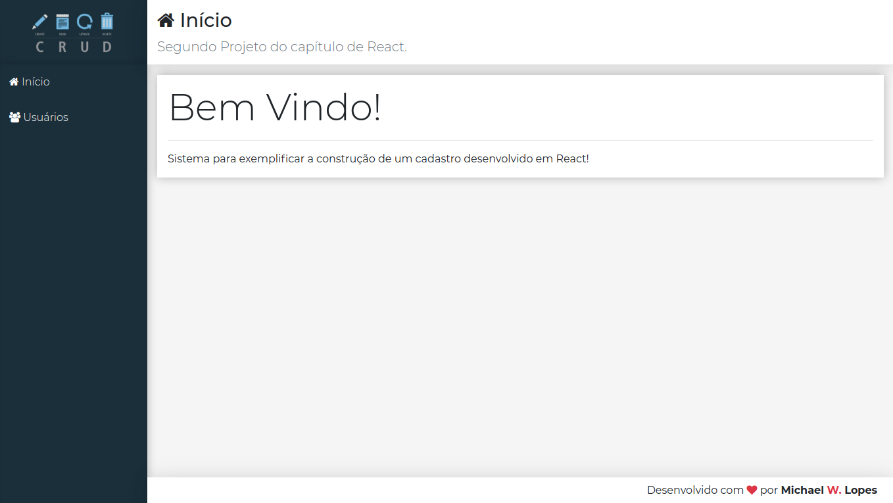
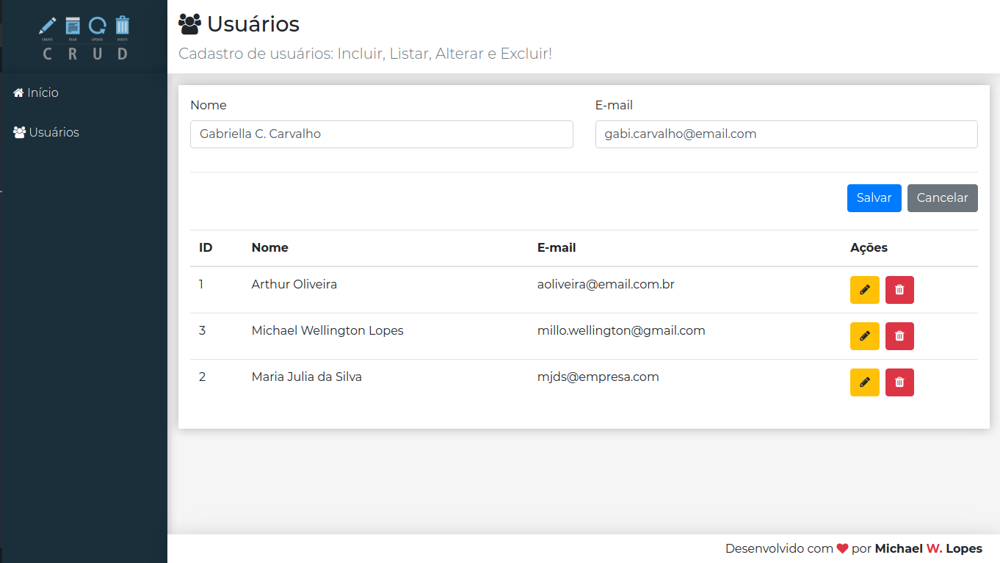
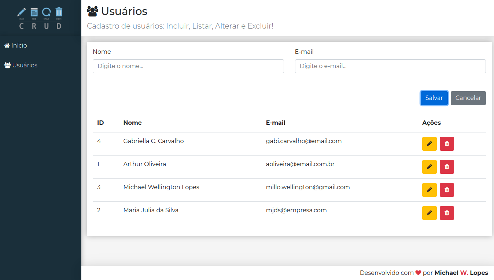

# CRUD EM REACT 

Esse projeto é onde podemos armazenar, editar ou excluir os dados de uma pessoa a lista. A criação do projeto conta com o desenvolvimento em React para a criação das telas e estilização.
Durante o desenvolvimento, aprendi os fundamentos do React como: JSX, Componentes, Ciclo de vida, Etilização em React, rotas, props e Herança de um component.Em seu back-end, aprendi conceitos de armazemantos de dados em formato JSON, como também a utilização do JSON-SERVER e integrar o back-end com o frontent para o consumo de dados.  

A imagem abaixo mostra a tela inicial do APP. 

 
 

Essa imagem mostra a tela da pagina de usuários, com os campos de nome e email preenchidos para a adição de um usuário a lista.

 
 

Essa imagem mostra o usuário sendo adicionando a lista de contatos que pode ser editado, ou até mesmo excluido.
